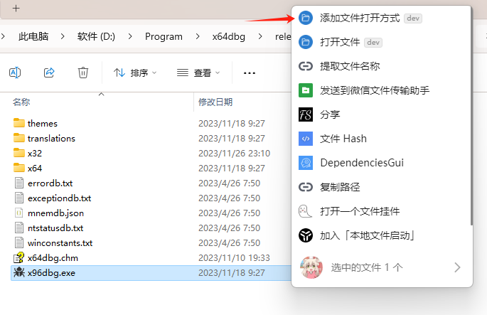
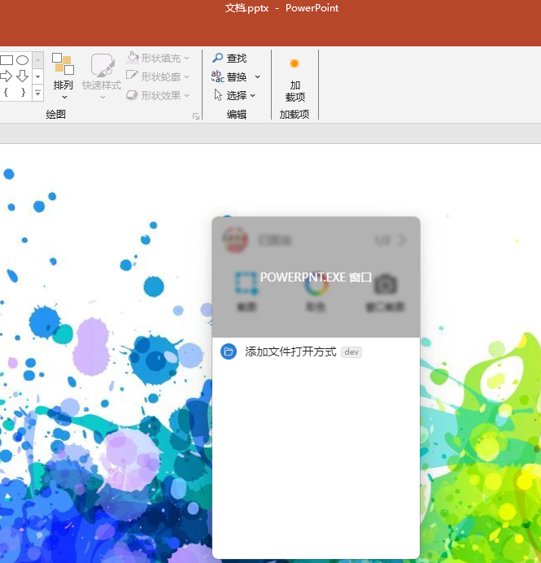
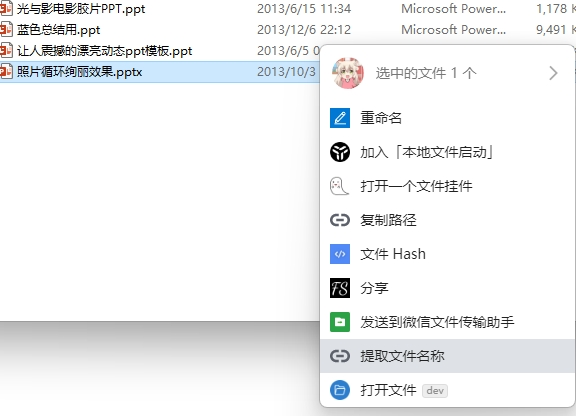
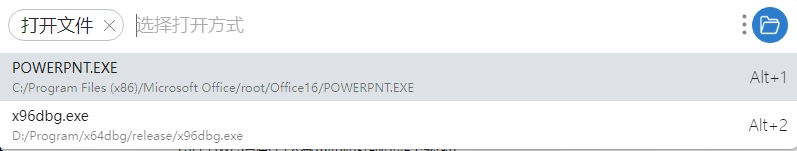
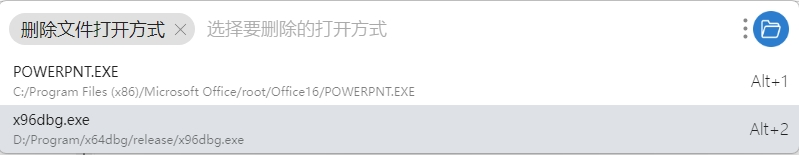

# 花式打开文件

这是一款基于utools的插件，用于实现打开文件时选择不同的打开方式

## 基础功能

### 新增打开方式

* 通过选中可执行文件添加打开方式

* 通过选择、复制文件路径添加打开方式

  

* 通过选择窗口添加打开方式

  

### 打开文件

1. 选中文件，点击鼠标中键

2. 选择打开方式

### 删除打开方式

1. 输入关键字 `删除文件打开方式`

2. 选择想删除的打开方式即可